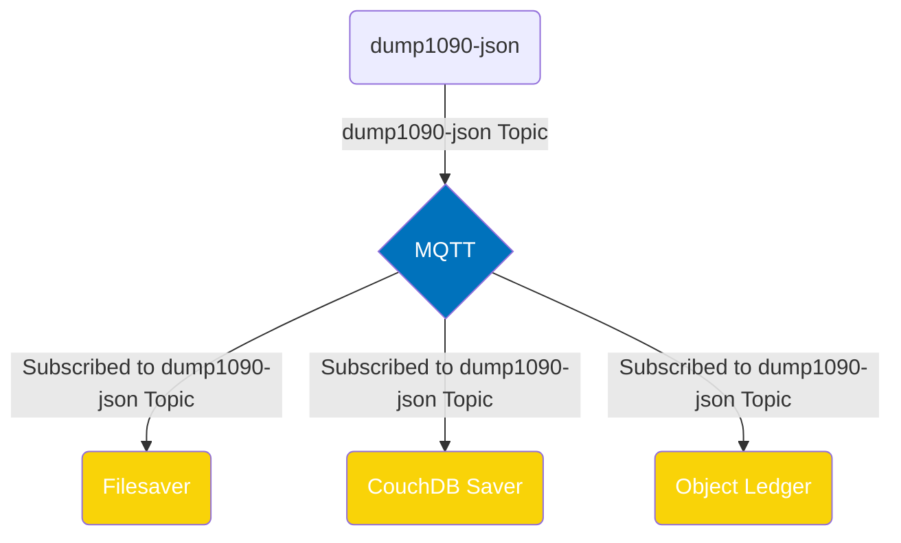

<a name="readme-top"></a>

[contributors-shield]: https://img.shields.io/github/contributors/IQTLabs/edgetech-dump1090-json.svg?style=for-the-badge
[contributors-url]: https://github.com/IQTLabs/edgetech-dump1090-json/graphs/contributors
[forks-shield]: https://img.shields.io/github/forks/IQTLabs/edgetech-dump1090-json.svg?style=for-the-badge
[forks-url]: https://github.com/IQTLabs/edgetech-dump1090-json/network/members
[stars-shield]: https://img.shields.io/github/stars/IQTLabs/edgetech-dump1090-json.svg?style=for-the-badge
[stars-url]: https://github.com/IQTLabs/edgetech-dump1090-json/stargazers
[issues-shield]: https://img.shields.io/github/issues/IQTLabs/edgetech-dump1090-json.svg?style=for-the-badge
[issues-url]: https://github.com/IQTLabs/edgetech-dump1090-json/issues
[license-shield]: https://img.shields.io/github/license/IQTLabs/edgetech-dump1090-json.svg?style=for-the-badge
[license-url]: https://github.com/IQTLabs/edgetech-dump1090-json/blob/master/LICENSE.txt
[product-screenshot]: images/screenshot.png

[Python]: https://img.shields.io/badge/python-000000?style=for-the-badge&logo=python
[Python-url]: https://www.python.org
[Poetry]: https://img.shields.io/badge/poetry-20232A?style=for-the-badge&logo=poetry
[Poetry-url]: https://python-poetry.org
[Docker]: https://img.shields.io/badge/docker-35495E?style=for-the-badge&logo=docker
[Docker-url]: https://www.docker.com

[![Contributors][contributors-shield]][contributors-url]
[![Forks][forks-shield]][forks-url]
[![Stargazers][stars-shield]][stars-url]
[![Issues][issues-shield]][issues-url]
[![MIT License][license-shield]][license-url]

<br />
<div align="center">
  <a href="https://iqt.org">
    
  </a>
</div>
<h1 align="center">edgetech-dump1090-json</h1>


This repo builds upon the <a href="https://github.com/IQTLabs/edgetech-core">IQT Labs Edgetech-Core</a> functionality to instantiate an <a href="https://projects.eclipse.org/projects/iot.mosquitto">MQTT</a> client that reads aircraft messages from dump1090's web interface JSON file.  It publishes each aircraft to a specified MQTT topic. All of this functionality is wrapped in a Docker container for cross-platform compatibility. 
<br/>
<br/>
<a href="https://github.com/IQTLabs/edgetech-dump1090-json/pulls">Make Contribution</a>
·
<a href="https://github.com/IQTLabs/edgetech-dump1090-json/issues">Report Bug</a>
·
<a href="https://github.com/IQTLabs/edgetech-dump1090-json/issues">Request Feature</a>


## Usage

This module is designed to be used in concert with other modules to
build a complete tracking system. [SkyScan](https://github.com/IQTLabs/SkyScan), 
which tracks aircraft using ADS-B transmissions, is an example of the type of 
system that can be built.

 Checkout the `docker-compose.yml` in that repo to see how these modules
 can be connected together. The configuration for the system is stored in `.env` environment files. Examples of the different environment files
 are included in the **SkyScan** repo and can be configured them to match your setup.


### Built With

[![Python][Python]][Python-url]
[![Poetry][Poetry]][Poetry-url]
[![Docker][Docker]][Docker-url]


### Prerequisites

Running this repo requires that you have [Docker](https://www.docker.com) installed. 

## Advanced Usage

Spinning up this system requires an MQTT server and this container to be included in your `docker-compose.yml`. You can find an example of this workflow in this repository's `docker-compose.yml`. Additionally, some editing of relevant environment variables will be required based upon your system's configuration of topics to subscribe to and MQTT configuration. Examples of these enviornment variables can be found in this repository's `.env` file. 

As this system is meant to be spun up with MQTT topics you would like to write to files, copying the dump1090-json `docker-compose` statements into a master `docker-compose.yml` and  `.env` files with your entire system of containers is the preferred workflow. Find an application architecture diagram example of how the usage of this module was envisioned below.




## Contributing

1. Fork the Project
2. Create your Feature Branch (`git checkout -b dev`)
3. Commit your Changes (`git commit -m 'adding some feature'`)
4. Run (and make sure they pass):
```
black --diff --check *.py

pylint --disable=all --enable=unused-import *.py

mypy --allow-untyped-decorators --ignore-missing-imports --no-warn-return-any --strict --allow-subclassing-any *.py
```
If you do not have them installed, you can install them with `pip install "black<23" pylint==v3.0.0a3 mypy==v0.991`.

5. Push to the Branch (`git push origin dev`)
6. Open a Pull Request

See `CONTRIBUTING.md` for more information.

## License

Distributed under the [Apache 2.0](https://github.com/IQTLabs/edgetech-dump1090-json/blob/main/LICENSE). See `LICENSE.txt` for more information.

## Contact IQTLabs

  - Twtiter: [@iqtlabs](https://twitter.com/iqtlabs)
  - Email: info@iqtlabs.org

See our other projects: [https://github.com/IQTLabs/](https://github.com/IQTLabs/)

<p align="right">(<a href="#readme-top">back to top</a>)</p>


